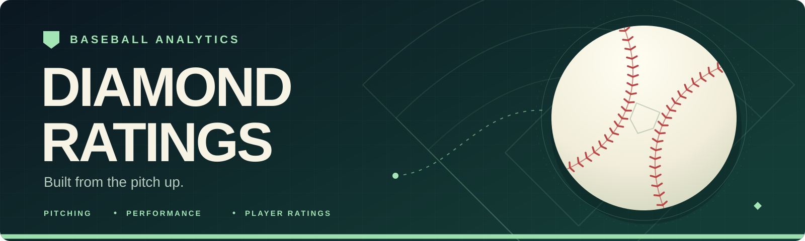

<div align="center">



[](#project-status)
[](#install)
[](https://github.com/maxmcdevitt1/diamond-ratings)

[How it Works](#how-it-works) · [Data](#data)· [Credits](#credits)

</div>

# Let's Rate the Diamond

**Diamond Ratings** is a Python project for taking your favorite player and creating a video game like **player rating**.

The current focus is pitching: fastball velocity, pitch movement, whiff rate, and wOBA allowed, with OpenCommand and FanGraphs data available for the next stages. The long-term goal is to combine player ratings into **team ratings**, then use them to predict games and seasons.


> [!NOTE]
> In development

| Area | Current state |
|---|---|
| Data loading | Statcast downloads and local Parquet/CSV readers |
| Pitcher attributes | Velocity, movement, WAR, whiff rate, and wOBA calculations |
| Hitter ratings | Starter modules and batting datasets |
| Team ratings & predictions | Planned |

## How it Works

### Summary

- Load pitch-level Statcast data and season-level supporting datasets.
- Measure pitcher attributes against the season's comparison group.
- Convert selected attributes into percentile scores.
- Develop a combined rating that weights recent performance more heavily.
- Extend the model to hitters, rosters, and team predictions.

The last two stages are the project direction, described in [objective.txt](objective.txt).


### Load pitching data

The loader requests **2021–2026** Statcast data, using March 27 through October 1 for each year. It saves one Parquet file per year in `data/pitching_data/` and skips files already present.

> The first run downloads multiple seasons and can take a while. The fixed date windows may omit games outside those dates, and an existing file is not automatically refreshed as a season progresses.


### Pipeline

```text
Statcast                     OpenCommand           FanGraphs
   │                              │                    │
   ▼                              ▼                    ▼
Season Parquet files         Command CSVs          Pitching CSVs
   │                              │                    │
   ▼                              └─────────┬──────────┘
Velocity · Movement · Whiff · wOBA          │
   │                                      │
   ▼                                      ▼
Attribute percentiles          Command / WAR integration
   └──────────────────┬───────────────────┘
                      ▼
            Combined player ratings
                      │
                      ▼
       Team ratings → Game / season predictions
```

| File | Role |
|---|---|
| [src/data_loader.py](src/data_loader.py) | Download Statcast data, look up player IDs, and read local datasets |
| [src/pitcher_attributes.py](src/pitcher_attributes.py) | Calculate pitcher attributes and supporting metrics |
| [src/pitcher_rating.py](src/pitcher_rating.py) | Player wrapper, percentile scores, and rating |
| [src/woba_weights.py](src/woba_weights.py) | Season-specific wOBA weights |
| [src/batter_attributes.py](src/batter_attributes.py) / [src/batter_rating.py](src/batter_rating.py) | Hitter rating scaffolding |

## Data

### Layout

The repository includes command, FanGraphs pitching, and batting CSVs. Statcast Parquet files are generated locally.

| Path | Seasons | Contents |
|---|---|---|
| `data/pitching_data/<year>.parquet` | 2021–2026 requested by the loader | Downloaded pitch-level Statcast records |
| `data/pitching_data/<year>command.csv` | 2024–2026 included | OpenCommand command scores |
| `data/fangraphs/fg_pitching_<year>.csv` | 2020–2026 included | FanGraphs pitching statistics |
| `data/batting_data/<year>_batting.csv` | 2021–2026 included | Batting datasets |

**Player matching:** Statcast calculations commonly group by `player_name` in `Last, First` format. Player lookup returns an MLBAM ID; the FanGraphs lookup uses `xMLBAMID`. Command integration uses its own `pitcher` field.

The hitting loader currently points to `data/pitching_data/stats.csv`, which is not included. Connecting it to the batting datasets is part of the unfinished hitter workflow.

## Topics

### What goes into a pitcher rating?

| Attribute | Current calculation |
|---|---|
| **Velocity** | Median fastball velocity across four-seamers (`FF`), sinkers (`SI`), and cutters (`FC`), compared with the season's pooled fastball median |
| **Movement** | Induced movement magnitude from `pfx_x` and `pfx_z`, converted to inches and compared within pitch categories |
| **Whiff** | Misses divided by swings using the event groups defined in `get_whif()`, then ranked by percentile |
| **wOBA allowed** | Weighted plate-appearance outcomes using that season's weights; lower wOBA earns a higher percentile |
| **Command** | Initial use of OpenCommand's `inferred_in` for `ALL` pitches with at least 200 observations; integration is in progress |
| **WAR** | Initial FanGraphs lookup; scoring is in progress |

The movement score weights category percentiles **50% breaking**, **30% offspeed**, and **20% fastball**. Its current implementation expects the pitcher to have all three categories.

### How should I read the scores?

Percentiles describe a player's position within the data being ranked. They are relative to that comparison group and are not a validated forecast of future performance.

## Credits

- [pybaseball](https://github.com/jldbc/pybaseball) — Statcast access and player ID lookup.
- [FanGraphs](https://www.fangraphs.com/) — supporting pitching statistics.
- [OpenCommand](https://github.com/tomdoyo/open-command) by [tomdoyo](https://github.com/tomdoyo) — command data.

OpenCommand's upstream code and data are released under [CC BY-NC-SA 4.0](https://github.com/tomdoyo/open-command/blob/main/LICENSE).
