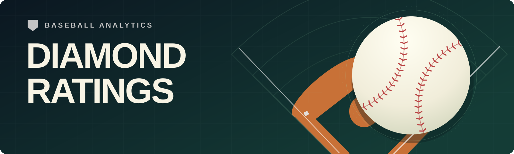

<div align="center">



[](#project-status)
[](#install)
[](https://github.com/maxmcdevitt1/diamond-ratings)

[How it Works](#how-it-works) · [Install](#install) · [Data](#data) · [Credits](#credits)

</div>

# Let’s Rate the Diamond

**Diamond Ratings** is a Python project that converts MLB player data into video game-style **player ratings**.

The project rates every pitcher and hitter in a season on a 50–99 scale, filters those league-wide ratings down to each team's 40-man roster, and rates each team on the same scale from the WAR its players produced. Pitcher attributes are velocity, movement, whiff rate, wOBA allowed, and control; hitter attributes are power, contact, and speed. Both get an overall (OVR) that is a weighted combination of those attributes and WAR. The long-term goal is to use these ratings alongside team statistics to predict final team performance and season results.

## Project status

> [!NOTE]
> In development

| Area | Current state |
|---|---|
| Data loading | Statcast downloads, MLB roster lookups, and local Parquet/CSV readers |
| Pitcher ratings | Velocity, movement, whiff, wOBA allowed, control, and OVR |
| Hitter ratings | Power, contact, speed, and OVR |
| Team ratings | Baseball-Reference WAR produced for each team, rated 50–99 against the other teams |
| Predictions | Planned |
| Tests | Not written yet |

## How it Works

### Summary

- Load a season of pitch-level Statcast data and the season-level supporting datasets.
- Calculate every attribute once for the whole league, one row per player.
- Convert each attribute to a 50–99 rating against the other players in that season.
- Retrieve each team's 40-man roster and filter the league-wide ratings down to it.
- Sum each team's WAR and rate it against the other 29 teams.
- Save the results as `batter.parquet`, `pitcher.parquet`, and `teams.parquet`.

The broader project direction is described in [objective.md](objective.md).

### Pipeline

```text
Statcast pitches        OpenCommand        Baseball Savant       Baseball-Reference
      │                      │              batting stats            WAR CSVs
      ▼                      ▼                    │                      │
Velocity · Movement       Control                 ▼                      │
Whiff · wOBA allowed         │          Power · Contact · Speed          │
      └──────────┬───────────┘                    │                      │
                 ▼                                ▼                      ▼
      League-wide pitcher ratings      League-wide hitter ratings    OVR + team WAR
                 └────────────────┬───────────────┘                      │
                                  ▼                                      │
                    Filter to each 40-man roster  ◄──────────────────────┘
                                  │
                                  ▼
               batter.parquet · pitcher.parquet · teams.parquet
```

| File | Role |
|---|---|
| [main.py](main.py) | Run the full pipeline for one season and save the three output files |
| [src/diamond_ratings/data_loader.py](src/diamond_ratings/data_loader.py) | Download and load datasets, retrieve MLB rosters, map player IDs, and save results |
| [src/diamond_ratings/pitcher_attributes.py](src/diamond_ratings/pitcher_attributes.py) | Calculate raw pitcher attributes |
| [src/diamond_ratings/batter_attributes.py](src/diamond_ratings/batter_attributes.py) | Calculate raw hitter attributes |
| [src/diamond_ratings/scale.py](src/diamond_ratings/scale.py) | Convert raw values to the 50–99 rating scale |
| [src/diamond_ratings/get_scores.py](src/diamond_ratings/get_scores.py) | Combine attributes into one league-wide ratings table for pitchers and one for hitters |
| [src/diamond_ratings/team_rating.py](src/diamond_ratings/team_rating.py) | Filter ratings to a team's roster and calculate the team rating |
| [src/diamond_ratings/woba_weights.py](src/diamond_ratings/woba_weights.py) | Store season-specific wOBA weights |

## Install

The data files are stored with [Git LFS](https://git-lfs.com/), so install it before cloning. The Statcast files total roughly 580 MB.

```bash
git clone https://github.com/maxmcdevitt1/diamond-ratings
cd diamond-ratings
git lfs pull
pip install -e .
python main.py
```

`main.py` rates the season set by `YEAR` at the top of the file, needs an internet connection for the roster and player-ID lookups, and overwrites the three output files in `data/`.

The package reads from the `data/` folder of the repository, so it has to be installed in editable mode from a clone; a standalone wheel install will not find the data.

## Data

### Layout

| Path | Seasons | Source | Contents |
|---|---|---|---|
| `data/pitching_data/<year>.parquet` | 2021–2026 | Statcast via pybaseball | Pitch-level records, regular season only |
| `data/pitching_data/<year>command.csv` | 2024–2026 | OpenCommand | Command scores per pitcher and pitch type |
| `data/pitching_data/<year>_bref_pitching_war.csv` | 2021–2026 | Baseball-Reference | Pitching WAR, one row per player per team |
| `data/batting_data/<year>_bref_hitting_war.csv` | 2021–2026 | Baseball-Reference | Hitting WAR, one row per player per team |
| `data/batting_data/stats.csv` | 2021–2026 | Baseball Savant | Season batting, expected, and batted-ball statistics |
| `data/batting_data/outs_above_average.csv` | 2021–2026 | Baseball Savant | Outs above average |

`data_loader.get_all_pitchers()` downloads any missing Statcast season, using March 27 through October 1 of each year. The fixed window can omit games outside those dates, and an existing file is not refreshed as a season progresses.

**Player matching:** MLBAM IDs are the primary identifier. Statcast uses the `pitcher` field, Baseball Savant and OpenCommand use `player_id` / `pitcher_id`, and Baseball-Reference IDs are converted to MLBAM IDs through pybaseball's lookup table. A player missing from that table gets no WAR, and his OVR is built from his attributes alone.

### Output

| File | Columns |
|---|---|
| `data/batter.parquet` | `player_id`, `name`, `year`, `contact`, `power`, `speed`, `WAR`, `OVR`, `team` |
| `data/pitcher.parquet` | `player_id`, `name`, `year`, `velocity`, `movement`, `whiff`, `woba`, `control`, `WAR`, `OVR`, `team` |
| `data/teams.parquet` | `team`, `WAR`, `rating` |

Only players who qualify for at least one attribute appear. A pitcher who qualifies for some attributes but not others has empty values for the ones he misses.

## Topics

### What goes into a pitcher rating?

| Attribute | Calculation | Minimum |
|---|---|---|
| **Velocity** | Median velocity across four-seamers (`FF`), sinkers (`SI`), and cutters (`FC`), relative to the league median | More than 100 fastballs |
| **Movement** | Induced movement magnitude from `pfx_x` and `pfx_z` in inches, measured against the league average for that pitch type, then averaged by pitch category | More than 350 pitches |
| **Whiff** | Misses divided by swings, using the event groups defined in `get_whif()` | 100 swings |
| **wOBA allowed** | Weighted plate-appearance outcomes using that season's wOBA weights; lower is better | More than 200 pitches |
| **Control** | OpenCommand's `inferred_in` for `ALL` pitches; lower is better | More than 200 pitches |

The movement score weights pitch categories **0.6 breaking**, **0.6 offspeed**, **0.1 fastball**, and **0.8 knuckleball**. A pitcher who doesn't throw a category is scored on the ones he does throw.

### What goes into a hitter rating?

Hitters need more than 200 plate appearances to receive attribute ratings.

| Attribute | Calculation |
|---|---|
| **Power** | Average of ISO, barrel rate, and EV50, each scaled from 0 to 1 across qualified hitters |
| **Contact** | 75% the average of batting average and expected batting average, 25% contact rate (100 minus whiff percentage) |
| **Speed** | Sprint speed |

### What goes into OVR?

OVR is a weighted average of a player's attribute ratings and his Baseball-Reference WAR, with WAR first rated 50–99 against the same group of players. The result is ranked again and put back on the 50–99 scale, so OVR spreads out the same way the individual attributes do.

| Pitchers | Weight | | Hitters | Weight |
|---|---|---|---|---|
| wOBA allowed | 25% | | Contact | 30% |
| Whiff | 20% | | Power | 30% |
| WAR | 20% | | WAR | 30% |
| Control | 15% | | Speed | 10% |
| Movement | 10% | | | |
| Velocity | 10% | | | |

If a player is missing a rating, it drops out and the remaining weights are rescaled. A player needs at least three attributes (not counting WAR) to get an OVR, so a pitcher who has thrown too little to qualify for more than two is listed without one. The weights and that minimum are set by `PITCHER_WEIGHTS`, `BATTER_WEIGHTS`, and `MIN_ATTRIBUTES` in [get_scores.py](src/diamond_ratings/get_scores.py).

### How should I read the scores?

Every attribute is ranked against the other qualified players in that season, and the ranking is mapped onto a bell curve centered on **75** with a standard deviation of 10, limited to **50–99**. A 75 is the league median for that attribute, an 85 is roughly the 84th percentile, and a 95 is roughly the 98th.

The WAR part of OVR accumulates with playing time, so it rewards how much a player has contributed over the season as well as how good he is per game.

**Team ratings** start from the sum of the WAR each player produced while on that team, so a traded player's WAR is split between his clubs. That total is then ranked against the other teams and put on the same 50–99 scale. With only 30 teams the steps are coarse: the top team is always 99 and the bottom team lands at 57.

These ratings describe relative performance and underlying player attributes. They are not validated forecasts of future performance.

## Credits

- [pybaseball](https://github.com/jldbc/pybaseball) — Statcast access and player ID lookup.
- [python-mlb-statsapi](https://github.com/zero-sum-seattle/python-mlb-statsapi) — MLB roster data.
- [Baseball Savant](https://baseballsavant.mlb.com/) — season batting statistics and outs above average.
- [Baseball-Reference](https://www.baseball-reference.com/) — WAR.
- [OpenCommand](https://github.com/tomdoyo/open-command) by [tomdoyo](https://github.com/tomdoyo) — command data.

OpenCommand’s upstream code and data are released under [CC BY-NC-SA 4.0](https://github.com/tomdoyo/open-command/blob/main/LICENSE).
